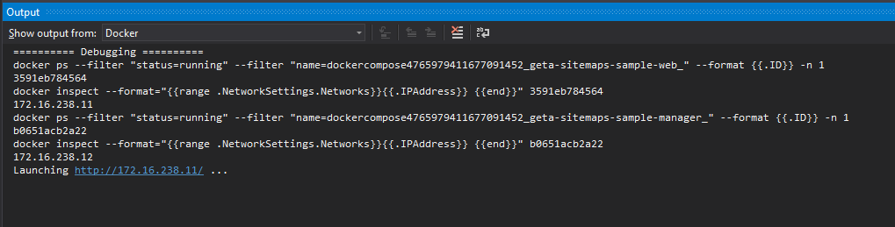

# Geta Package Shared Repository

## Purpose

Purpose of this repository contains some shareable content for all our packages.

## Local development set up

Each application should contain a sample project which can be used for testing the package functionality. Docker is used to simplify the set up of the local development machine. With this approach every developer can pull the code from the repository and run it in Visual Studio without doing manual steps (restoring database, configuring IIS, etc).

### Sample Sites

- Package that only contains CMS features: [Alloy](https://github.com/episerver/AlloyDemoKit)
- Package that contains CMS or/and Commerce features: [Quicksilver](https://github.com/episerver/Quicksilver)

### Docker Prerequisites

- Checkout the repository
- Install Docker on your local machine: https://docs.docker.com/get-started/
- Enabling virtualization in BIOS advanced CPU settings

If you don't enable virtualization in the BIOS you'll get this message when starting Docker:

```
Hardware assisted virtualization and data execution protection must be enabled in the BIOS
```

### Configure Docker for Sample Project

Right click sample project and select `Container support`.


This will create a `Dockerfile` which contains a PowerShell script and a new project called `docker-compose`. The `docker-compose` project holds the server images configurations.

The sample project should have a reference to the package project.

#### Windows Server Container(s)

For running either Alloy or Quicksilver a Windows container is used. For Quicksilver two containers are defined because commerce solutions also include the manager. The definition of the containers can be found in the `docker-compose.yml`. Example of the Quicksilver site:

```
geta-[PACKAGENAME]-sample-web:
  image: ${DOCKER_REGISTRY-}geta-[PACKAGENAME]-sample-web
  build:
    context: ..\EPiServer.Reference.Commerce.Site
    dockerfile: Dockerfile
  networks:
    geta-[PACKAGENAME]-network:
      ipv4_address: 0.0.0.0
  depends_on:
    - geta-[PACKAGENAME]-sample-db
  mac_address: 00-00-00-00-00-00
  volumes:
    - ../../../src/[PACKAGENAME]/module/:C:/data/
```

As you can see in the definition it contains a volume mapping for the `App_Data`. In this folder, you can normally find all the blobs. Make sure to use the correct path in the `<episerver.framework />:

```
<episerver.framework>
  <appData basePath="C:/appdata/" />
</episerver.framework>
```

More tips:

- Specify a MAC address for the Episerver License
- Define a static IP address (otherwise Docker uses a random IP)

And for the manager:

```
 geta-[PACKAGENAME]-sample-manager:
    image: ${DOCKER_REGISTRY-}geta-[PACKAGENAME]-sample-manager
    build:
      context: ..\EPiServer.Reference.Commerce.Manager
      dockerfile: Dockerfile
    networks:
     geta-[PACKAGENAME]-network:
        ipv4_address: 0.0.0.0
    depends_on:
     - geta-[PACKAGENAME]-sample-db
```

#### SQL Server Container

A separate SQL container is used for the database(s). The volume mapping is used for the location of the database files (.mdf and .ldf).

```
geta-[PACKAGENAME]-sample-db:
    image: microsoft/mssql-server-windows-developer:1709
    environment:
     - ACCEPT_EULA=Y
     - sa_password=SECRET
     - attach_dbs=[{'dbName':'[PACKAGENAME].Quicksilver.Cms','dbFiles':['C:\\data\\[PACKAGENAME].Quicksilver.Cms.mdf','C:\\data\\[PACKAGENAME].Quicksilver.Cms_log.ldf']},{'dbName':'[PACKAGENAME].Quicksilver.Commerce','dbFiles':['C:\\data\\[PACKAGENAME].Quicksilver.Commerce.mdf','C:\\data\\[PACKAGENAME].Quicksilver.Commerce_log.ldf']}]
    volumes:
      - ../EPiServer.Reference.Commerce.Site/App_Data/:C:/data/
    networks:
      - geta-[PACKAGENAME]-network
```

The connection string should point to the SQL container.

```
<connectionStrings>
    <clear />
    <add name="EPiServerDB" connectionString="Data Source=geta-[PACKAGENAME]-sample-db;Initial Catalog=[PACKAGENAME].Quicksilver.Cms;Integrated Security=False;User ID=sa;Password=SECRET;MultipleActiveResultSets=True" providerName="System.Data.SqlClient" />
    <add name="EcfSqlConnection" connectionString="Data Source=geta-[PACKAGENAME]-sample-db;Initial Catalog=[PACKAGENAME].Quicksilver.Commerce;Integrated Security=False;User ID=sa;Password=SECRET;Connect Timeout=10;Application Name=ECApplication" providerName="System.Data.SqlClient" />
  </connectionStrings>
```

#### Network

The Windows and SQL container definition includes a `networks:` configuration. This is mandatory so that both servers are hosted in the same network. The `-subnet` configuration is used so we can use static IP addresses for the containers.

```
networks:
  geta-[PACKAGENAME]-network:
    ipam:
      driver: default
      config:
         - subnet: '172.16.238.0/24'
```

#### Client resources

If the package includes client resources make sure that the files are grouped in one folder in the package project. In order to load them inside the sample site (Alloy or Quicksilver) define a virtual directory in the `Dockerfile`:

```
RUN New-WebVirtualDirectory -Site 'Default Web Site' -Name 'Episerver/[PACKAGENAME]/' -PhysicalPath c:\data\
```

In the docker-compose project create a volume mapping. For example:

```
geta-[PACKAGENAME]-sample-web:
  image: ${DOCKER_REGISTRY-}geta-[PACKAGENAME]-sample-web
  volumes:
    - ../../../src/[PACKAGENAME]/module/:C:/data/
```

This allows the developer to change the code in the package project without copying the files to the sample project.

See example implementations for [Geta.Tags](https://github.com/Geta/tags) and [Geta.SEO.Sitemaps](https://github.com/Geta/seo.sitemaps)

### Get Started with Sample Project

Set the `docker-compose` as default project (if not already by default). Now, the required images are downloaded (Windows server and SQL server), this will take some time. Note, this only happens the first time after that it cached on your local machine. See Output window (source Docker) to follow the progress. After you see the line 'Docker containers are ready', you are ready to run the project.


After the images are downloaded just run the project and start debugging the code. The frontend and backend code can be found in the package project. The frontend code is available under the module folder.

When the browser is not automatically opened, go to the docker output window and check the IP addresses.



You can find the IP addresses also in the `docker-compose.yml` file.

### QuickSilver login

Use the default admin@example.com user for QuickSilver, see [installation](https://github.com/episerver/Quicksilver).

### Alloy login

Use the default epiadmin user for Alloy, see [logins](https://github.com/episerver/AlloyDemoKit/wiki/Logins).
